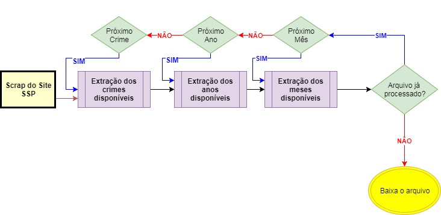

Obtém dados do site http://www.ssp.sp.gov.br/transparenciassp/.

Os arquivos são disponibilizados mensalmente.

Fluxo:


Segue um exemplo de como usar a classe:

```
import os
import sys

download_dir = os.path.join(os.getcwd(), 'Files')
log = logging.getLogger(__name__)
scraper = SSP_Scraper(download_dir=download_dir, log=log)
try:          
    scraper.process_crimes()
except:
    log.error(sys.exc_info())
```